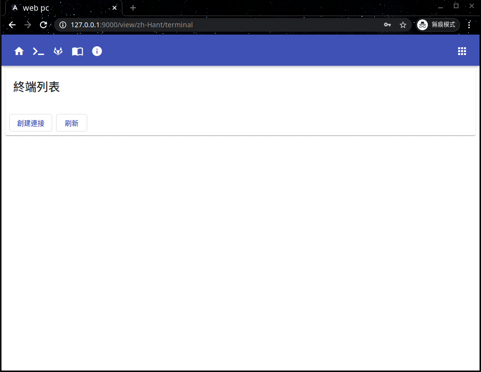
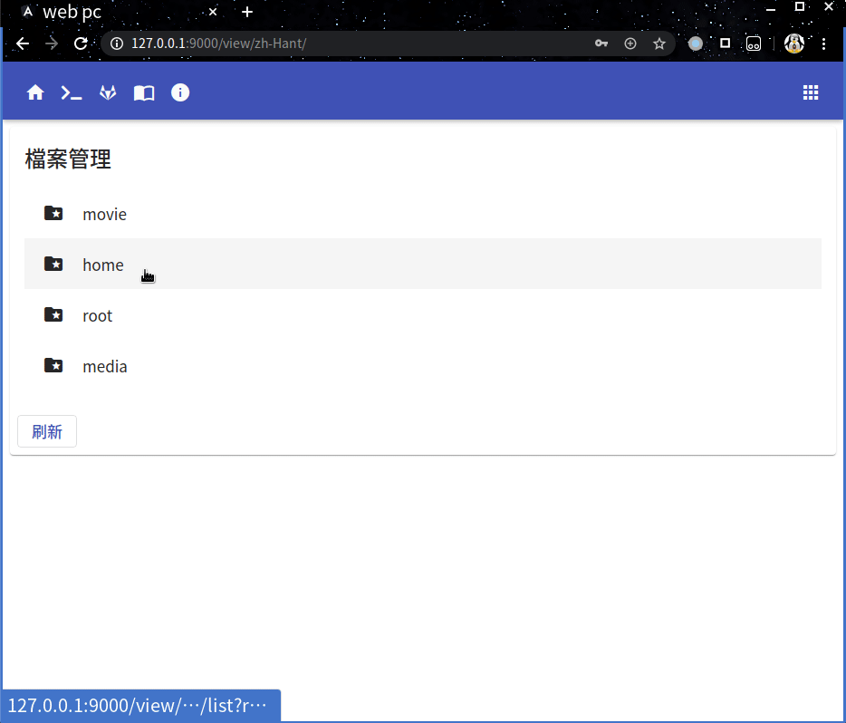

# WebApp

English(README.md) 中文

<table>
<tr>
<td>
  一個webapp程式，幫助通過web獲取服務器shell，同時這是一個http檔案服務器允許你管理服務器上的檔案 編輯 上傳 下載 分享 ，得益於 html5 你也可在在線播放服務器上的 視頻 音頻。 
</td>
</tr>
</table>

## 遠程shell

## 檔案管理

## Usage

1. 配置你的服務器 **webpc.jsonnet**
2. 運行服務器 `webpc daemon -r`
3. 使用瀏覽器 訪問你的 webpc [http://127.0.0.1:9000](http://127.0.0.1:9000)

## Linux Service

1. 編輯 **webpc.service** 修改裏面的程式啓動路徑 爲webpc安裝路徑
2. 將 **webpc.service** 拷貝到 服務定義目錄

## Sindows Service

1. 執行 `webpc-service install` 安裝服務
2. 使用 windows 服務管理器 啓動 webpc-service 服務