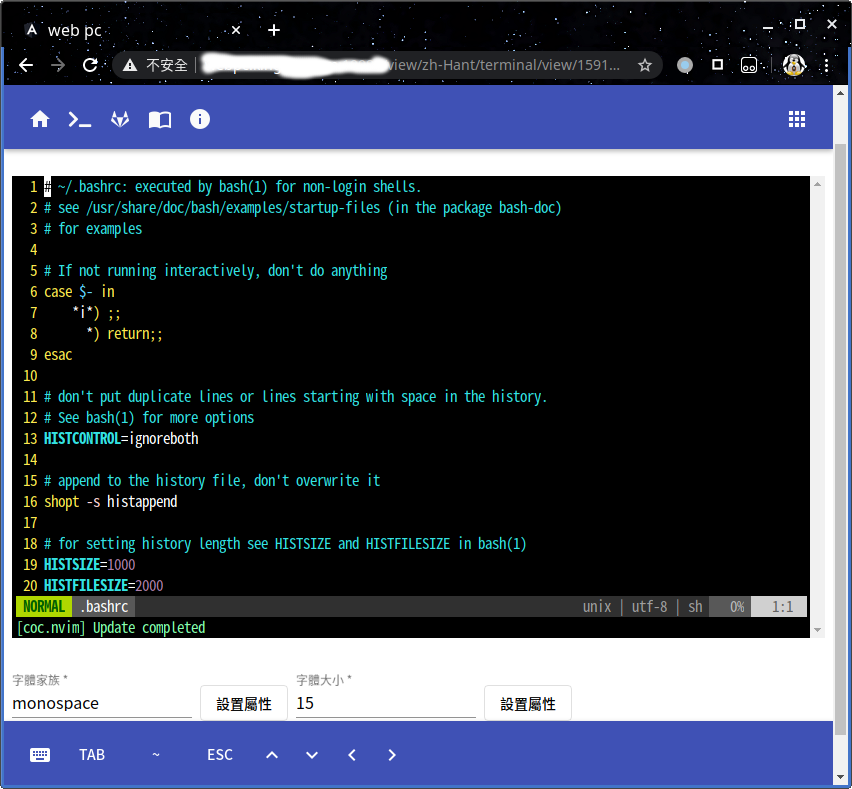
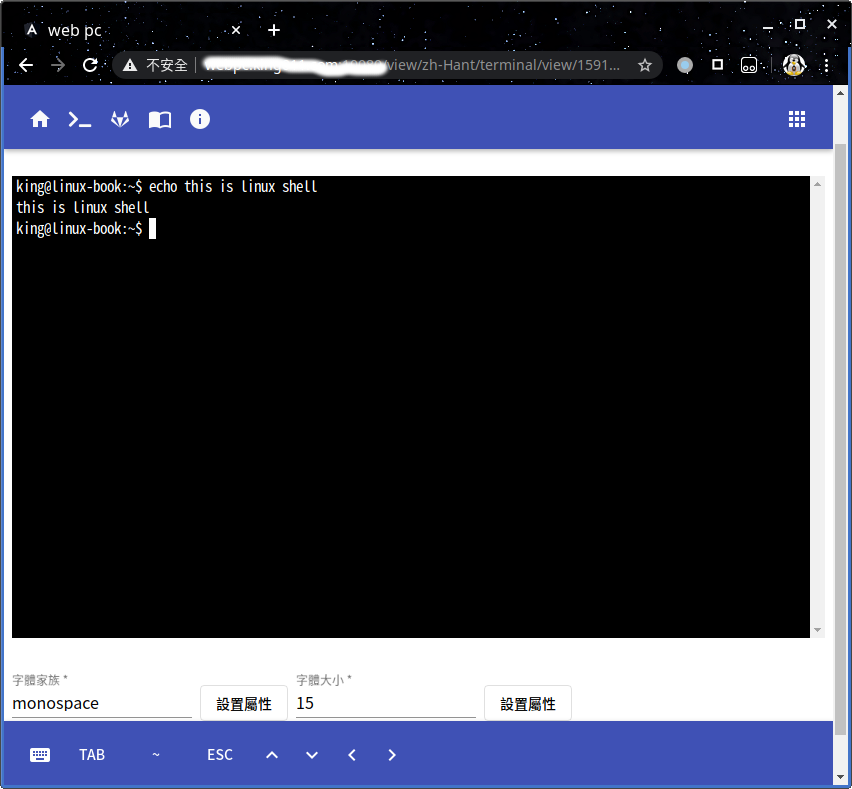
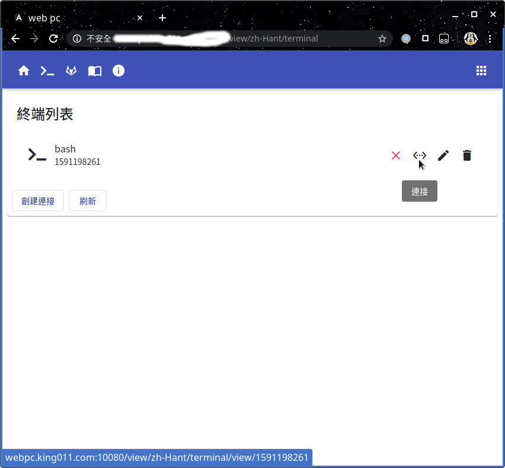
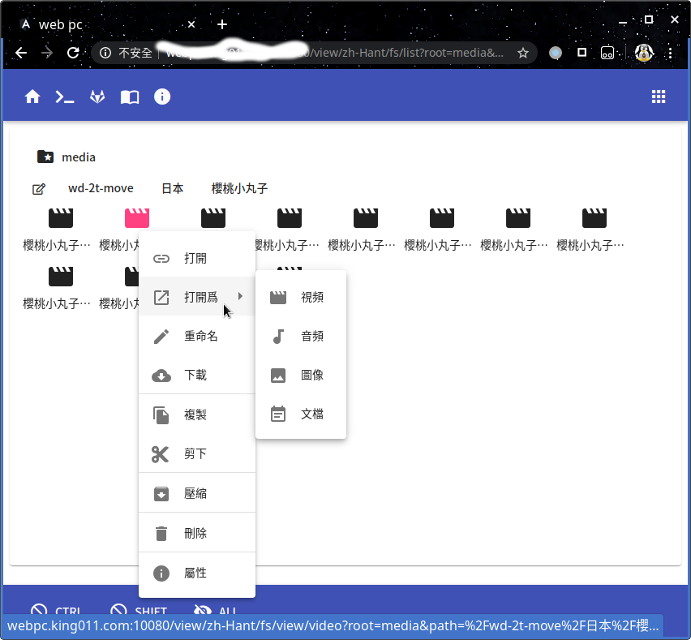
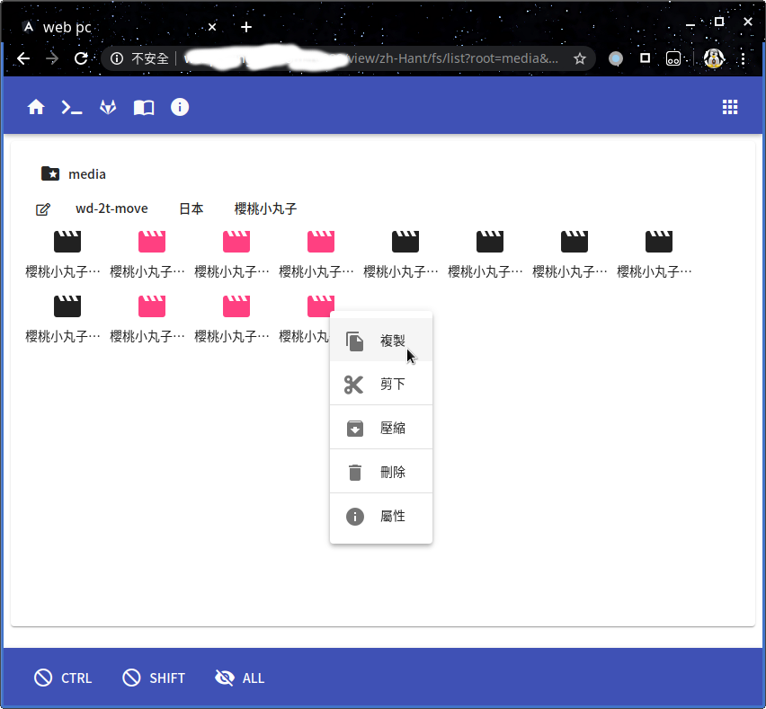
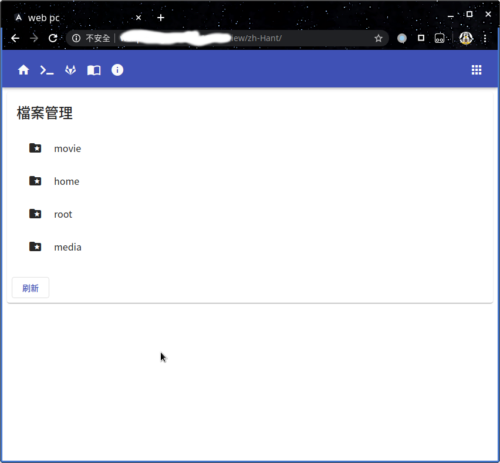

# webpc

* 源碼 [https://gitlab.com/king011/webpc](https://gitlab.com/king011/webpc)
* 下載 [https://gitlab.com/king011/webpc/-/tags](https://gitlab.com/king011/webpc/-/tags)

爲計算機開放一個web頁面的控制工具

目前支持 linux windows 理論上也可以運行在 golang支持的其它平臺 但我精力財力有限 未能測試其它平臺

# 特性

* 獲取系統 shell
* 檔案管理(仿照本地檔案管理器製作)
* 支持檔案上傳下載
* 支持 壓縮/解壓 檔案
* 在線 播放 視頻/音頻 預覽圖像 編輯簡單檔案
* 支持 指定掛接目錄 並設置 訪問權限
* 簡易用戶系統 指定不同用戶 可操作的 掛接點
* 目前支持 中文(zh-Hant zh-Hans)/英文(en-US) 

# 安裝 與 運行

1. [下載](https://gitlab.com/king011/webpc/-/tags) 對應平臺最新壓縮包 
2. 執行 `webpc daemon -r` 運行程式

## linux 服務

對應支持 systend 的系統 將 壓縮包中的 **webpc.service** 複製到 **/etc/systemd/system/** 目錄下即可

注意將 **webpc.service** 中 第八行 的 程式路徑 修改爲 你解壓的 實際路徑

```
ExecStart=/opt/webpc/webpc daemon -r
```

* 執行 `sudo systemctl start webpc.service` 啓動服務
* 執行 `sudo systemctl stop webpc.service` 關閉服務
* 執行 `sudo systemctl enable webpc.service` 將服務加入開機啓動

## windows 服務

1. 打開命令提示符 執行 `webpc-service.exe install` 即可 安裝服務
2. 使用 widnows的 服務管理器 啓動 webpc-service 服務

## 配置檔案

**webpc.jsonnet** 是程式配置檔案 需要 和 **webpc** 位於相同目錄下 (或使用 -c 參數 指定位置)

* HTTP 配置 http 服務器相關信息
* System.Shell 配置 web打開的 shell 如果爲空 對於不同系統會有一個 默認的值
* System.Mount 指定要掛接到web的 本地檔案夾 和此掛接點的 讀寫權限設置

```
local Millisecond = 1;
local Second = 1000 * Millisecond;
local Minute = 60 * Second;
local Hour = 60 * Minute;
local Day = 24 * Hour;
local KB=1024;
local MB=KB * 1024;
local GB=MB * 1024;
{
	HTTP: {
		Addr: ":9000",
		// x509 if empty use h2c
		// CertFile: "test.pem",
		// KeyFile: "test.key",
		// 設定 http 請求 body 最大尺寸
		// 如果 == 0 使用默認值 32 KB
		// 如果 < 0 不限制
		MaxBytesReader: 5 * MB,
	},
	System:{
		// 用戶數據庫
		DB : "webpc.db",
		// 用戶 shell 啓動腳本
		// linux 默認爲 shell-GOOS
		//Shell : "shell-linux",
		//Shell : "shell-windows.bat",
		// 映射到web的目錄
		Mount : [
			{
				// 網頁上 顯示的 目錄名稱
				Name: "movie",
				// 要映射的本地路徑
				Root: "/home/king/movie",
				// 設置目錄可讀 有讀取/寫入權限的用戶 可以 讀取檔案
				Read: true,

				// 設置目錄可寫 有寫入權限的用戶可以 寫入檔案
				// 如果 Write 爲 true 則 Read 會被強制設置爲 true
				Write: true,
				
				// 設置爲共享目錄 允許任何人讀取檔案
				// 如果 Shared 爲 true 則 Read 會被強制設置爲 true
				Shared: true,
			},
			{
				Name: "home",
				Root: "/home/king",
				Write: true,
				Read: true,
				Shared: false,
			},
			{
				Name: "root",
				Root: "/",
				Write: false,
				Read: true,
				Shared: false,
			},
			{
				Name: "media",
				Root: "/media/king/",
				Write: false,
				Read: true,
				Shared: false,
			},
		],
	},
	Cookie: {
		// Filename:"securecookie.json"
		MaxAge:Day*14,
	},
	Logger: {
		// zap http
		//HTTP: "localhost:20000",
		// log name
		//Filename:"logs/webpc.log",
		// MB
		MaxSize: 100, 
		// number of files
		MaxBackups: 3,
		// day
		MaxAge: 28,
		// level : debug info warn error dpanic panic fatal
		Level: "debug",
		// output code line and file
		Caller: true,
	},
}
```

# 運行預覽










